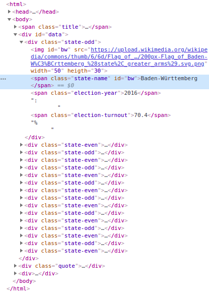
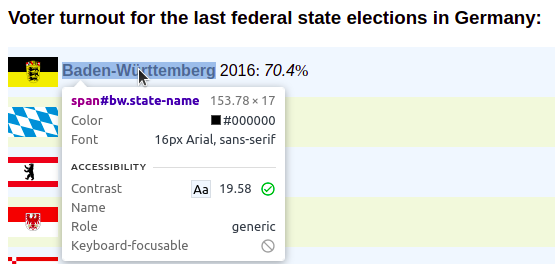

# CSS selectors & Developer Tools

``` {r, include = FALSE}
knitr::opts_chunk$set(collapse = TRUE)
knitr::opts_chunk$set(cache = TRUE)
knitr::opts_chunk$set(cache.path = 'cache/')
```

## CSS selectors {#css}

In the previous section, you already got to know the first CSS selectors. These 
are actually used in web design to select individual elements of a website and 
apply a CSS style to them, i.e. to define the display of the elements. So they
were not developed with web scraping applications in mind, yet we can still make
use of them, because we also want to select individual elements of a website in 
order to extract them.

CSS selectors are used in rvest as an argument of the `read_html()` function. 
As a second argument -- the first one determines which data the function should
be applied to --we specify a selector in the form `css = "selector"`. This
determines which elements of the HTML code we want to extract. It is important
here that the entire selector -- regardless of how many individual parts it
consists of -- is always passed along as a string to the argument.

In the following, the CSS selectors are applied to the website
<https://webscraping-tures.github.io/turnout.html>{target="_blank"}
for illustration. You can view the source code the usual way. Firstly, we load
the rvest package and parse the website.

``` {r, message = FALSE}
library(rvest)

website <- "https://webscraping-tures.github.io/turnout.html" %>% 
  read_html()
```

We have already learned about the simplest selector. `"Tag"` selects all
occurrences of the specified HTML tag. For example, we can select the title of
the website -- in the `<title>` tag -- or the heading displayed in the browser 
window -- in  `<h3>`.

``` {r}
website %>% 
  html_nodes(css = "title")

website %>% 
  html_nodes(css = "h3")
```

### Classes

We also got to know the selector for the argument `class` -- `".class"` -- in 
the previous section. We can select all `<span>` tags of the class 
`"state-name"` as follows:

``` {r}
website %>% 
  html_nodes(css = ".state-name") %>% 
  head(n = 2)


website %>% 
  html_nodes(css = "span.state-name") %>% 
  head(n = 2)
```

The first variation of the selector says, 
*select all elements of the class `"state-name"`*. The second variation 
says, *select all <span> elements of the class `"state-name"`*. For this 
website, both variations are equivalent in result, since all elements assigned 
the class `"state-name"` are also `<span>` tags. However, this does not 
always have to be the case. Different tags with different content may very well
have the same class in practice.

Basically, constructing CSS selectors is always a balancing act between 
functionality and readability. The selector should select exactly only the 
elements we are interested in, and at the same time be understandable. The 
latter is especially important when others -- or you yourself a few weeks later
-- read the code. Readability also means achieving a balance between length and 
clarity of the selector.

To illustrate:

``` {r}
website %>% 
  html_nodes(css = "body > div#data > div[class^=state-] > span.state-name") %>% 
  head(n = 2)
```

This is the full path through the hierarchical HTML structure, which leads us to
the result already seen above. You don't need to fully understand this one yet. 
But you can see that the selector can get long and complicated, and here we are
dealing with a very simply designed website. For me, the selector
`"span.state-name"` is a good choice, because it allows us to reach our 
goal and has a balance between brevity and readability that is pleasant for me.
But you must decide this for yourself in each individual case.

### IDs

Another common attribute in HTML elements, is the `id`. These identify 
individual HTML elements with a unique assigned name. Among other things, these
are used for design purposes, as part of scripts for the dynamic design of
websites or in HTML forms. We can also use them to extract individual elements
specifically.

In our example, the `<span>` tag, which includes the name of each state, has an
id that identifies the state with a two-character abbreviation:

```
<span class="state-name" id="bw">Baden-Württemberg</span>
```

The selector for IDs is being written as `"#id"`.

``` {r}
website %>% 
  html_nodes(css = "#bw")
```

In this case, however, we have selected more than we wanted. Because the `` 
tag, which represents the flags of the federal states, has the attribute 
`id="bw"` as well. Strictly speaking, this is against the HTML rules, but this 
is also a reality. We can't rely on the creators of a website to always write
clean HTML code, so we have to be able to deal with "rule violations" and 
unexpected structures.

The solution at this point is the combination of ID and tag in the selector,
in the form `"tag#id"`.

``` {r}
website %>% 
  html_nodes(css = "span#bw")
```

A combination with the class attribute is also possible.

``` {r}
website %>% 
  html_nodes(css = "span.state-name#bw")
```

In general, it should be noted that the CSS selectors are *case-sensitive*. 
This means that we also need to be case sensitive. In the entry for Hamburg, the
name of the id is capitalized:

```
<span class="state-name" id="HH">Hamburg</span>
```

If we want to extract this element, we have to use this way of writing in the
selector as well, `"#hh"` will not work.

``` {r}
website %>% 
  html_nodes(css = "span#hh")

website %>% 
  html_nodes(css = "span#HH")
```

### Attributes

ID and Class are attributes of HTML tags. Since both are particularly relevant 
in web design, the shortcuts presented above exist to select them quickly. 
However, we can use all attributes occurring in an HTML code to select elements. 
The corresponding CSS selector is written as `tag[attribute]`.

At the bottom of our example HTML code, there are three `<a>` tags. These have,
in addition to `href="url"` -- the linked page -- the attribute `target_=""`. 
This specifies how the link should open. The value `"_blank"` opens the link in
a new browser tab, `"_self"` in the active tab. For the second link no 
`target=""` attribute is set. In our example, to select all `<a>` tags that have
a `target` attribute, i.e. the first and third, we could proceed as follows:

``` {r}
website %>% 
  html_nodes(css = "a[target]")
```

With `"element[attribute='value']"` it is possible to select only attributes 
with a certain value. Note that the value is enclosed in single quotes. The 
manner of writing `"element[attribute="value"]"` would be split into the two
strings `"element[attribute="` and `"]"` and the R object `value`, which cannot
be interpreted by R in this combination. Instead, we use single quotes to define
the value of the attribute. This is a convention used in many programming 
contexts. Inside “ we use ‘, inside ‘ we use “ to be able to realize multiple 
levels of quotes.

If we want to select only the link that opens in a new tab:

``` {r}
website %>% 
  html_nodes(css = "a[target='_blank']")
```

This can be further modified by specifying that the value of an attribute should
have a certain beginning -- `"element[attribute^='beginning']"` -- a certain end
-- `"element[attribute$='end']"` -- or contain a certain partial term --
`"element[attribute*='partial term']"`. Thus, we could select the links based on
the beginning, the end, or any part of the URL assigned to the `href=""` 
attribute.

``` {r}
website %>% 
  html_nodes(css = "a[href^='https://www']")

website %>% 
  html_nodes(css = "a[href$='Deutschland']")

website %>% 
  html_nodes(css = "a[href*='webscraping']")
```


### Hierarchy levels

We can think of the hierarchy of an HTML structure as analogous to a family 
tree. A simplified representation of our example page as a family tree could 
look like this:

``` {r echo = FALSE}
library(echarts4r)
library(tidyverse)

html_tree <- tibble(
  name = '<html>',
    children = list(
      tibble(name = c('<head>', '<body>'),
        children = list(
          tibble(name = c('<title>', '<meta>', '<style>')),
          tibble(name = c('<span class="title">', '<div id="data">', '<div class="quote">', '<div>'),
            children = list(
              tibble(name = '<h3>'),
              tibble(name = c('<div class="state-odd">', '<div class="state-even">'),
                children = list(
                  tibble(name = c('', '<span class="state-name">', '<span class="election-year">', '<span class="election-turnout">')),
                  tibble(name = c('', '<span class="state-name">', '<span class="election-year">', '<span class="election-turnout">'))
                )
              ),
              tibble(name = '<a>'),
              tibble(name = '<a>')
            )
          )
        )
      )
    )
)


html_tree %>% 
  e_charts() %>% 
  e_tree(initialTreeDepth = 1) %>% 
  e_title("HTML Hierarchy - turnout.html")
```

By clicking on the elements of the family tree, you can expand and collapse the
hierarchy levels. Click once through the different levels and compare this with
the HTML source code of the page. When you're done with that, I suggest
collapsing `<head>` and expanding only `<div id="data">` in `<body>` and the
first `<div>` at the next level down. With that, you should see everything we
need below.

With the metaphor of the family tree and the associated terms "descendant",
"child/parent", and "sibling", we should have an easier time understanding the
slightly more advanced Selector concepts that follow.

#### Descendant

If element A is a "descendant" of element B, this means that A "descended" from
B over any number of generations. This can be one generation -- i.e. a direct
child-parent relationship; it can also be any number of generations -- i.e.
grandchildren and grandparents with any number of "grand" prefixes. In the 
selector, we write this as `"B A"`.

For example, if we want to select all `<span>` tags that descend from the
`<div id="data">` tag -- that is, a grandchild-grandparent relationship:

``` {r}
website %>% 
  html_nodes(css = "div#data span") %>% 
  head(n = 6)
```

It should be noted that we can only select younger generations with CSS 
Selectors. So, for example, we can't select the grandparents of the 
grandchildren by "flipping" the selector around. To select the grandparents --
i.e. `<div id="data">`, we would need to look at which element they descended 
from, for example `<body>`.

CSS selectors are not limited to mapping the relationship of two generations. 
A longer selector containing four generations and leading to the same result 
could look like this:

``` {r}
website %>% 
  html_nodes(css = "body div#data div span") %>% 
  head(n = 6)
```


#### Child/Parent

If we want to define direct child-parent relationships instead of lineages 
across any number of generations, we can do this with selectors in the form 
`"B > A"`. This means A is a direct child of B. Since the `<span>` tags selected
earlier are not direct children of `<div id="data">`, `"div#data > span"` would 
not achieve the desired goal here. However, the `<span>` tags are direct 
children of `<div>` with classes `"state-odd"` and `"state-even"`
respectively. Since there is no other direct child-parent relationship of 
`<span>` and `<div>` tags in our example, the selector `"div > span"` would 
already be sufficient. However, we could become more explicit to write less
error-prone code. Both `<div>` tags are similar in that their classes start with
`"state"` and we already know how to exploit this:

``` {r}
website %>% 
  html_nodes(css = "div[class^='state'] > span") %>% 
  head(n = 6)
```

If we do not want to select all children, but only certain ones, there are a 
number of options.

`":first-child"` selects the first child of an element:

``` {r}
website %>% 
  html_nodes(css = "div[class^='state'] > :first-child") %>% 
  head(n = 2)
```

However, these are not the `<span>` but the `` tags, as a quick look at the
family tree reminds us again. With `":nth-child(n)"` we can again specify more
precisely which child -- counted in the order in which they appear in the HTML 
code -- we are interested in. To make it clearer again that we are only 
interested in `<span>` children, we combine `"span"` and `"nth-child(n)"`:

``` {r}
website %>% 
  html_nodes(css = "div[class^='state'] > span:nth-child(2)") %>% 
  head(n = 2)
```

So we want to select all `<span>` tags that are the second child of the `<div>`
tags whose classes start with `"state"`.

If we would like to select only the last child, we could do this with
`:last-child`:

``` {r}
website %>% 
  html_nodes(css = "div[class^='state'] > span:last-child") %>% 
  head(n = 2)
```

#### Sibling(s)

The common children of a parent element can be seen as siblings within the 
metaphor of the family tree. On the lowest hierarchical level, we thus have four
siblings per federal state in our example. One `` and three `<span>` tags.
The selector `"Element-A ~ Element-B"` selects all siblings B that follow 
sibling A:

``` {r}
website %>% 
  html_nodes(css = "div[class^='state'] img ~ span") %>% 
  head(n = 6)

website %>% 
  html_nodes(css = "img ~ span") %>% 
  head(n = 6)
```

The result for both notations is identical. If we had `<span>` tags that follow
`` tags in other places in the HTML code in our example, the second variant
would no longer be explicit enough.

The selector `"Element-A + Element-B"` works in the same way, but only selects
the sibling B that follows directly after sibling A:

``` {r}
website %>% 
  html_nodes(css = "img + span") %>% 
  head(n = 2)

website %>% 
  html_nodes(css = "span.state-name + span") %>% 
  head(n = 2)
```

The selection of siblings can be further restricted with 
`"element:first-of-type"`, `"element:nth-of-type(n)"` and 
`"element:last-of-type"`. In this way, the first, nth and last sibling of a 
certain type can be selected. The siblings are thus differentiated according to
the type of element, with which our family tree metaphor is being somewhat 
overused.

``` {r}
website %>% 
  html_nodes(css = "div[class^='state'] > span:first-of-type") %>% 
  head(n = 2)

website %>% 
  html_nodes(css = "div[class^='state'] > span:nth-of-type(2)") %>% 
  head(n = 2)

website %>% 
  html_nodes(css = "div[class^='state'] > span:last-of-type") %>% 
  head(n = 2)
```


### Further selectors

The wildcard `"*"` selects all elements. For example, we can also select all 
children of an element in the following way:

``` {r}
website %>% 
  html_nodes(css = "div[class^='state'] > *") %>% 
  head(n = 8)
```

If we want to exclude certain elements from the selection, this is possible with
`":not(selector)"`. Here, all elements are selected, except those that we have
explicitly excluded. For example, all children except the `` elements:

``` {r}
website %>% 
  html_nodes(css = "div[class^='state'] > :not(img)") %>% 
  head(n = 6)
```

With `"selector-A, selector-B"`, several selectors can be linked with "and/or".
This makes it possible, for example, to select two `<span>` classes in one step:

``` {r}
website %>% 
  html_nodes(css = "div[class^='state'] > span.election-year, div[class^='state'] > span.election-turnout") %>% 
  head(n = 4)
```

You now know the selectors most commonly used in web scraping. An overview of 
these and all other CSS selectors can be found on the W3 pages:
<https://www.w3schools.com/cssref/css_selectors.asp>{target="_blank"}

In addition to CSS selectors, there is another way to select elements of an HTML 
page: *XPath*. This method is even more flexible and allows, among other things,
the selection of "ancestors", i.e. higher hierarchical levels, starting from a 
lower one. The price for the higher flexibility, however, is an often longer and
somewhat more complicated syntax. In most cases, the CSS selectors will suffice. 
And if at some point you reach a point where they are no longer sufficient to
achieve your scraping goal, you will already be so proficient in using the CSS
selectors that you will find it very easy to switch to XPath. On the pages of 
the W3, you will find a suitable introduction.:
<https://www.w3schools.com/xml/xpath_intro.asp>{target="_blank"}

## Developer Tools
``` {r, include = FALSE}
library(knitr)
```

Recognising the HTML structure and identifying functional selectors can be very
difficult on complex websites, especially if the HTML code is not as clearly 
formatted as in our example. This is where it can be helpful to use the 
*web developer tools* built into modern browsers.

On the following screenshots, you can see the application in Chromium for Linux
on our running example page. However, the procedure is almost identical in other
browsers such as Chrome, Firefox or Edge. In all cases, open the Developer Tools
by right-clicking in the browser window and then selecting "Inspect Element".

Depending on the setting, the Developer Tools open in a horizontally or 
vertically separated area of the browser. We see a variety of tabs here, but for
this introduction we will concentrate purely on the "Elements" tab. This shows 
us the HTML code in its hierarchical structure and allows us to expand and c
ollapse individual elements.

``` {r, echo = FALSE, fig.retina = 1}
include_graphics("wdt/wdt_01.png")
```

If we select an element in "Elements", it will also be marked in the display in
the browser window.

``` {r, echo = FALSE, fig.retina = 1}

```

``` {r, echo = FALSE, fig.retina = 1}
include_graphics("wdt/wdt_02b.png")
```

We can also activate the "Inspector" and select elements directly in the browser
window by clicking on it.

``` {r, echo = FALSE, fig.retina = 1}
include_graphics("wdt/wdt_03.png")
```

``` {r, echo = FALSE, fig.retina = 1}

```

This in turn selects the corresponding entry in the "Elements" tab.

``` {r, echo = FALSE, fig.retina = 1}
include_graphics("wdt/wdt_04b.png")
```

The bottom of the "elements" tab, shows us the full CSS selector belonging to 
the selected element.

``` {r, echo = FALSE, fig.retina = 1}
include_graphics("wdt/wdt_05.png")
```

By right-clicking on an element and selecting "Copy" -> "Copy selector", we can
also get a CSS selector in the clipboard, which we can then paste into RStudio
with CTRL+V. For the element selected above, i.e. the state name for
Baden-Württemberg, we get the selector `"#bw"`. In this case, this short 
selector is sufficient to uniquely identify the element. However, as explained
above, I recommend the construction of more unique and comprehensible selectors.
However, the selector created by the Developer Tools, and especially the display
of the full path in the "Elements" tab, can be very helpful in constructing 
these and allow us to quickly grasp the structure of a website.

Also, although we learned how to select the name for Baden-Württemberg, we did
not learn, for example, how to select all the names of the federal states. But 
here, too, the developer tools can be helpful. One approach would be to select 
several of the name elements one after the other and compare how the full CSS
selector changes. If we identify similarities and differences between the name
elements, this can give us starting points for formulating our own selector. 
Another possibility would be to use the *SelectorGadget* extension instead of
the integrated developer tools. Among other things, this enables the selection 
of several elements at the same time. You can find information on how to use it 
at:<https://selectorgadget.com/>{target="_blank"}
