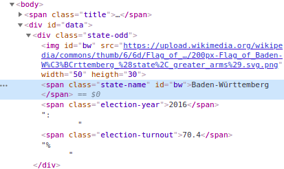
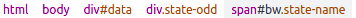

# CSS selectors & Developer Tools

``` {r, include = FALSE}
knitr::opts_chunk$set(collapse = TRUE)
```

## CSS selectors {#css}
In dem vorangegangenen Abschnitt, haben Sie bereits die ersten CSS Selectors 
kennengelernt. Diese werden im Webdesign eigentlich dazu genutzt, um einzelne 
Elemente einer Website auszuwählen und einen CSS Style auf diese anzuwenden, 
also die Darstellung der Elemente zu definieren. Sie wurden also nicht im 
Hinblick auf Web Scraping Anwendungen entwickelt, wir können sie uns aber 
trotzdem zu Nutze machen, denn auch wir möchten einzelne Elemente einer Website
auswählen, um diese gezielt zu extrahieren.

CSS Selectors kommen in rvest als Argument der Funktion `read_html()` zum 
Einsatz. Als zweites Argument, das erste legt fest auf welche Daten die Funktion 
angewandt werden soll, geben wir einen Selector in der Form `css = "selector"`
an. Dieser bestimmt welche Elemente des HTML-Code wir extrahieren möchten. 
Wichtig ist dabei, dass immer der gesamte Selector -- unabhängig davon aus wie 
vielen einzelnen Teilen dieser besteht -- von doppelten Anführungszeichen
eingefasst ist.

Zur Veranschaulichung, werden die CSS Selectors im Folgenden auf die Website 
<https://webscraping-tures.github.io/wahlbeteiligung_2.html>{target="_blank"}
angewandt. Den Quellcode können sie auf dem bekannten Weg einsehen. Zunächst 
laden wir das rvest package und lesen die Website ein.

``` {r}
library(rvest)

website <- "https://webscraping-tures.github.io/wahlbeteiligung_2.html" %>% 
  read_html()
```

Den einfachsten Selector haben wir bereits kennengelernt. `"Tag"` wählt alle 
Vorkommnisse des angegebenen HTML-Tags aus. So können wir beispielsweise den 
Titel der Website -- im Tag `<title>` oder die im Browserfenster dargestellte 
Überschrift -- `<h3>` -- auswählen.

``` {r}
website %>% 
  html_nodes(css = "title")

website %>% 
  html_nodes(css = "h3")
```

### Klassen
Auch den Selector für das Argument `class` -- `".class"` -- haben wir bereits 
im vorangegangenen Abschnitt kennengelernt. Alle `<span>` tags der Klasse 
`"bundesland-name`" können wir wie folgt auswählen:

``` {r}
website %>% 
  html_nodes(css = ".bundesland-name") %>% 
  head(n = 2)


website %>% 
  html_nodes(css = "span.bundesland-name") %>% 
  head(n = 2)
```

Die erste Variante des Selectors sagt, 
*wähle alle Elemente der Klasse `"bundesland-name"` aus*. Die zweite Variante 
sagt, *wähle alle `<span>` elemente der Klasse `"bundesland-name"` aus. Für 
diese Website sind beide Schreibweisen im Ergebnis äquivalent, da alle Elemente,
denen die Klasse `"bundsland-name"` zugewiesen wurde auch `<span>` Tags sind. 
Dies muss aber nicht immer so sein. Unterschiedliche Tags mit unterschiedlichen 
Inhalten können in der Praxis durchaus die selbe Klasse haben. 

Grundsätzlich sollten wir uns beim konstruieren von CSS Selectors von zwei 
Fragen leiten lassen. Wie viele Bestandteile benötigen wir um unser Ziel zu 
erreichen? Und, wie gut ist der Selector lesbar? Die erste Frage ist dabei 
leitend. Wenn wir unser Ziel ein bestimmtes Element auszuwählen mit einem
Selector nicht erreichen können, ist dieser noch nicht einsetzbar und muss 
überarbeitet werden. Haben wir einen funktionstüchtigen Selector, sollten wir
uns aber auch Gedanken zur Lesbarkeit machen. Möchten wir unseren R Code an 
andere Menschen weitergeben, sollte dieser so klar geschrieben sein, dass er für
Andere nachvollziehbar ist. Aber auch wenn wir selbst in einer Woche oder einem 
Monat nochmal in unseren Code schauen, kann es hilfreich sein einen möglichst 
klaren Selector zu lesen, denn wir können uns vermutlich nicht mehr an die 
Details des HTML-Quellcodes erinnnern. Dabei bedeutet Lesbarkeit auch, eine 
Balance zwischen Länge und Klarheit des Selectors zu erreichen. 
Zur Veranschaulichung:

``` {r}
website %>% 
  html_nodes(css = "body > div#daten > div[class^=bundesland-] > span.bundesland-name") %>% 
  head(n = 2)
```

Dies ist der volle Pfad durch die hierarchische HTML-Struktur, welcher uns zu 
dem oben bereits gesehenen Ergebnis führt. Diesen müssen sie jetzt noch nicht 
voll verstehen. Sie sehen aber, dass der Selector lang und kompliziert werden 
kann, und hier handelt es sich um eine sehr einfach gestaltete Website. Für 
mich, ist der Selector `"span.bundesland-name"` eine gute Wahl, da er ermöglicht
unser Ziel zu erreichen und dabei eine für mich angenehme Balance zwischen Kürze
und Lesbarkeit hat. Dies müssen sie aber im Einzelfall für sich selbst
entscheiden.


### IDs
Ein weiteres häufig auftretendes Attribut in HTML-Elementen, ist die `id`. Diese
identifizieren einzelne HTML-Elemente mit einem eindeutigen zugewiesenen Namen. 
Diese werden unter anderem zu gestalterischen Zwecken, im Rahmen von Scripts zur
dynamischen Gestaltung von Websites oder in HTML-Formularen eingesetzt. Uns 
interessiert dabei vor allem, dass wir sie nutzen können um einzelne Elemente 
gezielt zu extrahieren.

In unserem Beispiel, hat der `<span>` Tag, welcher den Namen eines jeden 
Bundeslandes umfasst, eine id, welche das Land mit einem zweistelligen Kürzel 
identifiziert:

```
<span class="bundesland-name" id="bw">Baden-Württemberg</span>
```

Der Selector für IDs wird als `"#id"` geschrieben.

``` {r}
website %>% 
  html_nodes(css = "#bw")
```

In diesem Fall haben wir aber mehr ausgewählt, als wir wollten. Denn auch der 
`` Tag, welcher die Flaggen der Bundesländer darstellt, hat das Attribut 
`id="bw"`. Dies verstößt zwar strenggenommen gegen die HTML-Regeln, aber auch 
dies ist Realität. Wir können uns nicht darauf verlassen, dass die Ersteller 
einer Website immer sauberen HTML-Code verfassen und müssen somit auch mit 
"Regelverstößen" und unerwarteten Strukturen umgehen können. 

Die Lösung ist an dieser Stelle die Kombination von ID und Element im Selector, 
in der Form `Element#id`.

``` {r}
website %>% 
  html_nodes(css = "span#bw")
```

Auch eine Kombination mit dem Klassenattribut ist möglich.

``` {r}
website %>% 
  html_nodes(css = "span.bundesland-name#bw")
```

Generell ist zu beachten, dass die CSS Selectors *case-sensitive* sind. Das 
bedeutet, dass wir auf Groß- und Kleinschreibung achten müssen. Im Eintrag für 
Hamburg, ist der Name der id groß geschrieben:

```
<span class="bundesland-name" id="HH">Hamburg</span>
```

Möchten wir dieses Element extrahieren, müssen wir diese Schreibweise auch im 
Selector anwenden, `"id=hh"` wird nicht funktionieren.

``` {r}
website %>% 
  html_nodes(css = "span#hh")

website %>% 
  html_nodes(css = "span#HH")
```

### Attribute
ID und Class sind Attribute von HTML-Tags. Da beide im Webdesign besonders 
relvant sind, existieren die oben vorgestllten *shortcuts* um diese schnell 
auszuwählen. Wir können aber alle in einem HTML-Code auftretenden Attribute zur
Auswahl von Elementen nutzen. Der zugehörige CSS Selector wird als 
`element[attribute]` geschrieben. 

In unterem Bereich unserer Beispiel HTML, finden sich drei Links -- `<a>` -- 
diese haben neben `href="url"` - der verlinkten Seite, noch das Attribut 
`target_""` dieses legt fest, wie sich der Link öffnen soll. Der Wert `"_blank"`
öffnet den Link einem neuen Browsertab, `"_self"` im aktiven Tab. Für den 
zweiten Link ist kein `target=""` Attribut festgelegt. Um in unserem Beispiel 
alle `<a>` Tags auszuwählen die ein `target` Attribut haben, also den ersten und
dritten, könnte man wie folgt vorgehen:

``` {r}
website %>% 
  html_nodes(css = "a[target]")
```

Mit `"element[attribute='value']"` ist es möglich, nur Attribute mit einem 
bestimmten Wert auszuwählen. Dabei ist zu beachten, dass value in einfache 
Anführungszeichen eingefasst ist. Sie haben ja bereits gesehen, dass die Werte
von HTML-Attributen im Quelltext stets von doppelten Anführungszeichen 
umschlossen sind. Da wir die doppelten Anführungszeichen schon nutzen um Beginn
und Ende unseres CSS Selectors zu definieren, können wir diese nicht nochmals 
innerhalb des Selectors selbst nutzen. Stattdessen, verwenden wir einfache 
Anführungszeichen um den Wert des Attributs zu definieren. Dies ist eine 
Konvention die in vielen R Kontexten Anwendung findet. Innerhalb doppelter 
Anführungszeichen nutzen wir einfache, innerhalb einfacher doppelte, um mehrere
Ebenen von Anführunszeichen realisieren zu können.

Möchten wir nur den Link auswählen, der sich in einem neuen Tab öffnet:

``` {r}
website %>% 
  html_nodes(css = "a[target='_blank']")
```

Dies lässt sich weiter modifizieren, in dem wir angeben dass der Wert eines 
Attributs einem bestimmten Anfang -- `"element[attribute^='anfang']"` -- oder 
ein bestimmtes Ende -- `"element[attribute$='ende']"` -- haben, oder einen 
bestimmten Teilbegriff enthalten soll -- `"element[attribute*='teilbegriff']"`. 
So könnten wir die Links anhand des Beginns, des Endes oder einem beliebigen 
Bestandteil der dem `href=""` Attribut zugewiesenen URL auswählen.

``` {r}
website %>% 
  html_nodes(css = "a[href^='https://www']")

website %>% 
  html_nodes(css = "a[href$='Deutschland']")

website %>% 
  html_nodes(css = "a[href*='webscraping']")
```


### Hierachieebenen

Wir können uns die Hierarchie einer HTML-Struktur analog zu einem 
Familienstammbaum vorstellen. Eine vereinfachte Darstellung unserer 
Beispielseite als Stammbaum, könnte so aussehen:

``` {r echo = FALSE}
library(echarts4r)
library(tidyverse)

html_tree <- tibble(
  name = '<html>',
    children = list(
      tibble(name = c('<head>', '<body>'),
        children = list(
          tibble(name = c('<title>', '<meta>', '<style>')),
          tibble(name = c('<span class="titel">', '<div id="daten">', '<div class="quote">', '<div>'),
            children = list(
              tibble(name = '<h3>'),
              tibble(name = c('<div class="bundesland-odd">', '<div class="bundesland-even">'),
                children = list(
                  tibble(name = c('', '<span class="bundesland-name">', '<span class="wahljahr">', '<span class="wahlbeteiligung">')),
                  tibble(name = c('', '<span class="bundesland-name">', '<span class="wahljahr">', '<span class="wahlbeteiligung">'))
                )
              ),
              tibble(name = '<a>'),
              tibble(name = '<a>')
            )
          )
        )
      )
    )
)


html_tree %>% 
  e_charts() %>% 
  e_tree(initialTreeDepth = 1) %>% 
  e_title("HTML Struktur - wahlbeteiligung_2.html")
```

Per Klick auf die Elemente des Stammbaums, können sie die Hierarchiebenen ein- 
und ausklappen. Klicken Sie sich einmal durch die verschiedenen Ebenen und 
vergleichen Sie dies mit dem HTML-Quellcode der Seite. Wenn Sie damit fertig 
sind, schlage ich vor`<head>`einzuklappen und in `<body>` nur `<div id="daten">`
und auf der nächst niedrigeren Ebene den ersten `<div>` auszuklappen. Damit 
sollten Sie alles sehen, was wir im Folgenden benötigen.

Mit der Metapher des Stammbaums und den dazugehörigen Begriffen "descendant", 
"child/parent" und "sibling", sollte es uns leichter fallen, die folgenden etwas
fortgeschritteneren Selector Konzepte zu verstehen.

#### Descendant
Wenn Element A ein "descendant" von Element B ist, bedeutet dies dass A von B 
über beliebig viele Generationen "abstammt". Dies kann eine Generation -- also 
eine direkte Kind-Eltern Beziehung -- oder beliebig viele Generationen -- also 
Enkel und Großeltern mit beliebig vielen "Ur" Präfixen -- sein. Im Selector 
schreiben wir dies als `"B A"`.

Möchten wir beispielsweise alle `<span>` Tags auswählen die von dem Tag 
`<div id="daten">` abstammen, also eine Enkel-Großeltern Beziehung:

``` {r}
website %>% 
  html_nodes(css = "div#daten span") %>% 
  head(n = 6)
```

Dabei ist zu beachten, dass wir mit CSS Selectors immer nur jüngere Generationen
auswählen können. Wir können also beispielsweise nicht Die Großeltern der Enkel 
auswählen indem wir den Selector "herumdrehen". Um die Großeltern -- also 
`<div id="daten">` auszuwählen, müssten wir betrachten, von welchem Element 
diese abstammen, also beispielsweise `<body>`.

Die CSS Selectors sind nicht darauf beschränkt das Verhältnis von zwei 
Generationen abzubilden. Ein längerer Selector der vier Generationen beinhaltet 
und zum selben Ergebnis führt könne so aussehen:

``` {r}
website %>% 
  html_nodes(css = "body div#daten div span") %>% 
  head(n = 6)
```


#### Child/Parent

Möchten wir statt Abstammungen über beliebig viele Generationen hinweg, direkte 
Kind-Eltern Beziehungen definieren, können wir dies mit Selectors in der Form 
`"B > A"` durchführen. Dies bedeutet, A ist ein direkts Kind von B. Da die zuvor 
ausgewählten `<span>` Tags keine direkten Kinder von `<div id="daten">` sind, 
würde `"div#daten > span"` hier nicht zum gewünschten Ziel führen. Die `<span>`
Tags sind aber direkte Kinder der `<div>` mit den Klassen `"bundesland-odd"` 
bzw. `"bundesland-even"`. Da es keine weitere direkte Kind-Eltern Beziehung von
`<span>` und `<div>` Tags in unserem Beispiel gibt, wäre der Selector 
`"div > span"` bereits ausreichend. Ich denke, wir könnten aber expliziter 
werden um weniger fehleranfälligen Code zu schreiben. Beide `<div>` Tags ähneln
sich darin, dass ihre Klassen mit `"bundesland"` beginnen und wir wissen ja 
bereits, wie wir dies ausnutzen können:

``` {r}
website %>% 
  html_nodes(css = "div[class^='bundesland'] > span") %>% 
  head(n = 6)
```

Möchten wie nicht alle Kinder auswählen, sondern nur bestimmte, besteht eine 
Reihe von Möglichkeiten.

`":first-child"` wählt das erste Kind eines Elements aus.

``` {r}
website %>% 
  html_nodes(css = "div[class^='bundesland'] > :first-child") %>% 
  head(n = 2)
```

Dies sind jedoch nicht die `<span>` sondern die `` Tags , wie uns auch ein 
schneller Blick in den Stammbaum nochmals vergegenwärtigt. Mit `":nth-child(n)"`
können wir nochmals genauer bestimmen, an welchem Kind -- gezählt in der 
Reihenfolge in der sie im HTML-Code auftauchen -- wir interessiert sind. Um 
nochmals klarer zu machen, dass wir nur an `<span>` Kindern interessiert sind, 
kombinieren wir `"span"` und `"nth-child(n)"`

``` {r}
website %>% 
  html_nodes(css = "div[class^='bundesland'] > span:nth-child(2)") %>% 
  head(n = 2)
```

Wir möchten also alle `<span>` selektieren die das zweite Kind von `<div>` deren 
Klassen mit `"bundesland"` beginnen sind.

Möchten wir nur das letzte Kind selektieren, könnten wir dies mit 
`"span:nth-child(4)"` selektieren, oder wir nutzen eine Abkürzung und wenden
`":last-child"` an.

``` {r}
website %>% 
  html_nodes(css = "div[class^='bundesland'] > span:last-child") %>% 
  head(n = 2)
```


#### Sibling(s)

Die gemeinsamen Kinder eines Eltern-Elements, lassen sich im Rahmen der Metapher
des Stammbaums als Geschwister sehen. Auf der untersten Hierarchieebene, haben 
wir in unserem Beispiel also pro Bundesland vier Geschwister. Einen `` und
drei `<span>` Tags. Der Selector `"Element-A ~ Element-B"` wählt dabei alle 
Geschwister B aus, die auf Geschwister A folgen.

``` {r}
website %>% 
  html_nodes(css = "div[class^='bundesland'] img ~ span") %>% 
  head(n = 6)

website %>% 
  html_nodes(css = "img ~ span") %>% 
  head(n = 6)
```

Das Ergebnis bei beiden Schreibweisen ist identisch. Hätten wir in unserem 
Beispiel `<span>` Tags die auf `` Tags folgen auch an anderen Stellen im 
HTML-Code, wäre die zweite Variante aber nicht mehr explizit genug.

Der Selector `"Element-A + Element-B"` funktioniert analog, wählt aber nur das 
Geschwisterkind B aus, das direkt auf Geschwister A folgt.

``` {r}
website %>% 
  html_nodes(css = "img + span") %>% 
  head(n = 2)

website %>% 
  html_nodes(css = "span.bundesland-name + span") %>% 
  head(n = 2)
```

Weiter einschränken lässt sich die Selektion der Geschwister mit 
`"element:first-of-type"`, `"element:nth-of-type(n)"` und 
`"element:last-of-type"`. So lassen sich das erste, n-te und letzte 
Geschwisterkind eines bestimmten Typs auswählen. Die Geschwister werden also
nach der Art des Elements unterschieden, womit unsere Stammbaum Metapher langsam
etwas überstrapaziert ist.

``` {r}
website %>% 
  html_nodes(css = "div[class^='bundesland'] > span:first-of-type") %>% 
  head(n = 2)

website %>% 
  html_nodes(css = "div[class^='bundesland'] > span:nth-of-type(2)") %>% 
  head(n = 2)

website %>% 
  html_nodes(css = "div[class^='bundesland'] > span:last-of-type") %>% 
  head(n = 2)
```


### Weitere Selektoren

Die wildcard `"*"` wählt alle Elemente aus. So können wir beispielsweise auch 
auf folgendem Weg, alle Kinder eines Elements selektieren:

``` {r}
website %>% 
  html_nodes(css = "div[class^='bundesland'] > *") %>% 
  head(n = 8)
```

Möchten wir bestimmte Elemente bei der Selektion ausschließen, ist dies mit 
`":not(selector)"` möglich. Hier werden alle Elemente ausgewählt, außer denen 
die wir so explizit augeschlossen haben. Beispielsweise alle Kinder, außer den 
`` Elementen:

``` {r}
website %>% 
  html_nodes(css = "div[class^='bundesland'] > :not(img)") %>% 
  head(n = 6)
```

Mit `"selector-A, selector-B"` lassen sich mehrere Selektoren mit "und" 
verknüpfen. So wird es beispielsweise möglich, zwei `<span>` Klassen in einem 
Schritt zu selektieren:

``` {r}
website %>% 
  html_nodes(css = "div[class^='bundesland'] > span.wahljahr, div[class^='bundesland'] > span.wahlbeteiligung") %>% 
  head(n = 4)
```

Sie kennen jetzt die im Web Scraping gebräuchlisten Selektoren. Eine Übersicht 
zu diesen und allen weiteren CSS Selectors, findet sich auf den Seiten der W3: 
<https://www.w3schools.com/cssref/css_selectors.asp>{target="_blank"}

Neben CSS Selectors gibt es mit *XPath* eine weitere Möglichkeit Elemente einer
HTML-Seite auszuwählen. Diese Methode ist noch etwas flexibler und erlaubt unter
anderem auch die Auswahl von "ancestors", also von höheren Hierarchieebenen, 
ausgehend von einer niedrigeren. Der Preis für die höhere Flexibilität ist aber
auch eine oft längere und etwas kompliziertere Syntax. In den meisten Fällen, 
werden Ihnen die CSS Selectors völlig ausreichen. Und falls Sie irgendwann an 
einen Punkt stoßen, an denen sie nicht mehr ausreichen um ihr Scraping Ziel zu 
erreichen, sind sie bereits so geübt im Umgang mit den CSS Selectors, dass Ihnen
der Umstieg auf XPath sehr leicht fallen wird. Auf den Seiten der W3, finden sie
dann eine passende Einführung: 
<https://www.w3schools.com/xml/xpath_intro.asp>{target="_blank"}


## Developer Tools
``` {r, include = FALSE}
library(knitr)
```
Das Erkennen der HTML-Struktur und das identifizieren von funktionstüchtigen 
Selektoren, kann auf komplexen Websites sehr schwer sein, vor allem dann, wenn 
der HTML-Code nicht so übersichtlich formatiert ist, wie in unserem Beispiel. 
Hier kann es hilfreich sein, die in modernen Browsern integrierten 
*Web Developer Tools* zu verwenden.

Auf den folgenden Screenshots, sehen Sie die Anwendung in Chromium für Linux auf
unsere laufende Beispielseite. Das Vorgehen ist aber in anderen Browsern wie 
Chrome, Firefox oder Edge nahezu identisch. In allen Fälllen öffnen sie die 
Developer Tools durch einen Rechtsklick im Browserfenster und dann der Auswahl
"Untersuchen" bzw. "Inspect".

Je nach Einstellung öffnen sich die devloper tools in einem horizontal oder 
vertikal abgetrennten Bereich des Browsers. Wir sehen hier eine Vielzahl von 
Reitern, für diese Einführung konzentrieren wir uns aber rein auf den Reiter 
"Elements". Dieser zeigt uns den HTML-Code in seiner hierarchischen Struktur und
erlaubt einzelne Elemente ein- und auszuklappen.

``` {r, echo = FALSE, fig.retina = 1}
include_graphics("wdt/wdt_01.png")
```

Wählen wir ein Element in "Elements" aus, wird dieses auch in der Darstellung im
Browserfenster markiert.

``` {r, echo = FALSE, fig.retina = 1}
include_graphics("wdt/wdt_02a.png")
```

``` {r, echo = FALSE, fig.retina = 1}
include_graphics("wdt/wdt_02b.png")
```

Auch können wir den "Inspector" aktivieren und Elemente direkt im Browserfenster 
per Klick auswählen. 

``` {r, echo = FALSE, fig.retina = 1}
include_graphics("wdt/wdt_03.png")
```

``` {r, echo = FALSE, fig.retina = 1}
include_graphics("wdt/wdt_04a.png")
```

So wird wiederum der korrespondierende Eintrag im 
"Elements" Reiter ausgewählt.

``` {r, echo = FALSE, fig.retina = 1}

```

Das untere Ende des "Elements" Reiters, zeigt uns den zu dem ausgewählten 
Element gehörenden vollen CSS Selector.

``` {r, echo = FALSE, fig.retina = 1}

```

Mit einem Rechtsklick auf ein Element und der Auswahl von "Copy" -> 
"Copy selector", können wir uns außerdem einen CSS Selector in den 
Zwischenspeicher holen, den wir dann in R Studio mit STRG+V einfügen können. 
Für das oben ausgewählte Element, also dem Ländernamen für Baden-Württemberg, 
bekommen wir den Selector "#bw". In diesem Fall ist dieser Kurze Selector 
ausreichend, um das Element eindeutig zu identifizieren. Ich empfehle aber, 
wie oben ausgeführt, die Konstruktion von eindeutigeren und besser 
nachvollziehbaren Selektoren. Der von den Developer Tools erstellte Selector, 
sowie vor allem die Darstellung des vollen Pfads im "Elements" Reiter, können 
jedoch bei der Konstruktion dieser sehr hilfreich sein und ermöglichen ein 
schnelles Erfassen der Struktur einer Website.

Auch haben wir so zwar erfahren, wie wir den namen für Baden-Württemberg 
auswählen, aber beispielsweise nicht, wie wir alle Namen der Bundesländer 
selektieren können. Aber auch hier können die Developer Tools hilfreich sein. 
Eine Herangehensweise wäre es, mehrere der Namenselemente nacheinander 
auszuwählen und zu vergleichen, wie sich der volle CSS-Selector verändert. 
Identifizieren wir darüber Gemeinsamkeiten und Unterschiede zwischen den 
Namenselemente, kann uns dies Ansatzpunkte geben um unseren eigenen Selector zu
formulieren. Eine weitere Möglichkeit wäre es, statt der integrierten Developer
Tools, die Erweiterung *SelectorGadget* zu nutzen. Diese ermöglicht unter
anderem die Auswahl mehrere Elemente gleichzeitig. Informationen zur Nutzung 
finden Sie unter: <https://selectorgadget.com/>{target="_blank"}
